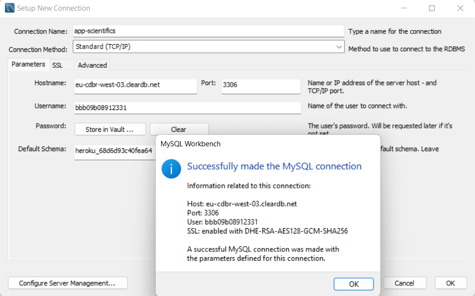

# Spring_REST_API-scientific-project-backend
Spring Project with JPA + H2 (Simple CRUD N:N) + ER with up to three Entities.
####
```
ENDPOINTS

Scientific

GET       /scientifics
POST      /scientifics
GET       /scientifics/{id}
PUT       /scientifics/{id}
DELETE    /scientifics/{id}

Project

GET       /projects  
POST      /projects
GET	    /projects/{id}
PUT       /projects/{id}
DELETE    /projects/{id}

Assignment

GET       /assignments
POST      /assignments
GET       /assignments/{id}
PUT       /assignments/{id}
DELETE    /assignments/{id}
```
####

